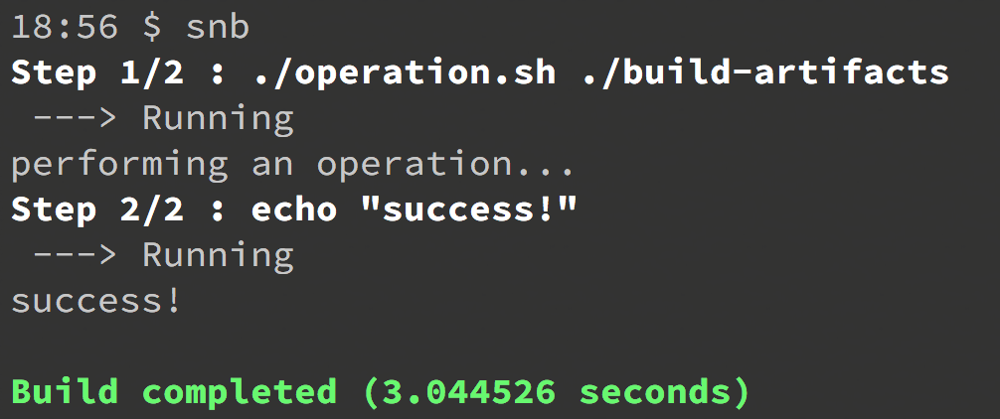

# snb

[](https://travis-ci.org/aemengo/snb)



snb, abbreviation for *"Shake 'N Bake"*, is a flexible build automation tool with caching capabilities and straightfoward rules. To use, simply run the executable in the directory containing a **ShakeAndBakeFile** spec or pass the directory as an argument.

## Installation

Using [Homebrew](https://brew.sh/):

```bash
$ brew update
...

$ brew install aemengo/snb/snb https://github.com/aemengo/snb
```

## Spec

```bash
$ cat ShakeAndBakeFile
RUN ./operation.sh ./build-artifacts

RUN echo "success!"
```

An example **ShakeAndBakeFile** looks like above. Steps are declared with `RUN` directive and must be terminated with a completely blank line or the end of the file. Multi-line statements are supported.

## Implementation

Each step is scanned for referenced files and directories. A sha1 checksum is taken after each is executed, for the aforementioned files and directories, and stored in a sqlite database in `.snb/snb.db`. When snb is invoked again, the step definition and checksums of referenced files and directories are compared: opting to skip any steps that completely match.

> A best practice is to document the input and output artifacts of every step that you'd wish snb to track for changes.


### Step Details
 
* Each step is executed in its own `bash` shell, so declared environment variables and directory changes will not carry over. 
* Each step is executed relative to the directory of the ShakeAndBakeFile.
* Each step is executed with all environment variables of the shell that snb is invoked in.
* Each step without any referenced files or directories will not be cached.


## Building

### Prerequisites

* [Golang](https://golang.org/): 1.10+

1. `cd` into the root directory of the project.

2. Compile the snb library.

	```bash
	$ go build .
	```

## Testing
   
1. Install the [ginkgo](https://github.com/onsi/ginkgo) test runner cli
   
	```bash
	$ go get -u github.com/onsi/ginkgo/ginkgo
	```

2. Execute tests

	```bash
	$ ginkgo -r
	```

## License

[Apache 2.0](LICENSE).

Copyright (c) 2018 Anthony Emengo